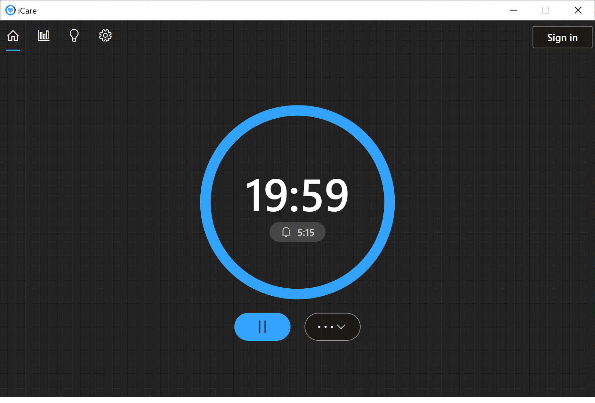

**Table of Contents**

[TOC]

# 1 Introduction

## 1.1 Why iCare?

Many of us spend plenty of time staring at the computer screen every day. This can put a lot of strain on our eyes and cause eye fatigue. iCare is a desktop app that uses the 20-20-20 rule to motivate users to develop good habits to avoid eye strain without being too intrusive to their schedule. iCare would suggest users to take a 20-second break every 20 minutes and look at something at least 20 feet away.

## 1.2 The 20-20-20 rule

# 2 Installation

## 2.1 Windows

1. Open your browser and navigate to &lt;TODO: insert site link>. 
2. Click the green **_Download iCare for Windows_** button.
3. Once the download is complete, open **iCareSetup.exe** to finish installation

## 2.2 macOS

1. Open your browser and navigate to icare.github.io/setup. 
2. Click the green **_Download iCare for Mac_** button.
3. Once the download is complete, open Finder and navigate to the downloaded file
4. Double-click **_iCareSetup.dmg_** to open.
5. Once installation is complete, drag the iCare app into your Applications folder.

## 2.3 Linux

**TODO**

# 3 Getting Started

## 3.1 Application overview

## 

# 4 Timer

## 4.1 Overview of the timer interface

<table>
   <tr>
      <td>Start/Pause
      <td>If the timer is paused, starts the timer. If the timer is running, pauses the timer.
   <tr>
      <td>More
      <td>

      Expands a pop-up menu with additional buttons.
      Opens the timer in a new window.
      Restarts the countdown.

   <tr>
      <td> Remaining time
      <td> The remaining time in MM:SS format.
   <tr>
      <td> End time
      <td> The time in which the timer will end.
<h2>

## 4.2 How breaks work

Ideas:

When time is up, popup notif shows

	Indicating start of 20s break

FIve seconds into the break

	Notification will take over the screen

Break resets when you move your mouse

# 5 iCare Account

## 5.1 Why make an account?

To be able to use all of iCare’s extensive features, you must register and create an account.

Ideas:

Unlock functionalities

Access to usage data and insights

	Preference synchronization

## 5.2 How to sign-in or sign-up

Sign-up

1. Click Sign in at the top right corner. The Sign in window should appear.
2. Click ‘Don’t have an account?’ to go to the sign-up page.
3. Complete all fields.
4. Provide your name, email address, and create a password for your iCare account.
    1. Your password must contain at least 8 characters.
5. Click Sign up.

Sign-in

1. Click Sign in at the top right corner. The Sign in window should appear.
2. On the sign in page, enter the email address and password that you registered with.
3. Click Sign in.

# 6 Usage Data

## 6.1 Data Usage

The iCare application will, by default, collect your PC’s data usage statistics that is associated with your account. It will keep track of the total amount of screen time and the total amount of times the timer has been successfully used per day on the account.

This information will be used for you to keep track of the time you have spent on your device and how much you have been diligently following the 20-20-20 rule over the past 7 days.

If you do not want the iCare application to collect your data, it is possible to turn off this data collection feature in your account’s user preferences. Furthermore, when you delete your account the data associated with your account will automatically be deleted from our server.

## 

## 6.2 App Usage

The iCare application will, by default, collect information on how much time you spend on any applications that your PC will use when linked to your iCare account. These application statistics will be used for you to keep track of the amount of time you have spent on these applications over the past 7 days.

If you do not want the iCare application to collect your application data, you can turn this feature off in **Preferences**. Furthermore, when you delete your account the application data associated with your account will automatically be deleted from our server.

# 7 Insights

## 7.1 Default Insights

The default insights cards are insight

## 7.2 Custom Insights

-Unimplemented dynamic insights based on usage data

# 8 Preferences

## 8.1 Overview of preferences

## 8.2 Notifications

**Notification interval**

Slide bar options vary from 5 minutes to 60 minutes.

**Enable sound notifications**

Sound notification is on by default.

Sound

Choose embedded sound from dropdown menu

Play the sound by clicking on 

Import the sound from local computer by clicking on 

## 8.3 Startup 

## 8.4 Data usage

Track my application usage statistics

Enable weekly usage statistics

## 8.5 Sync

Upload

Download
