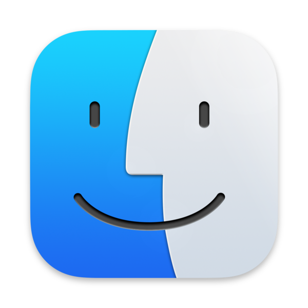
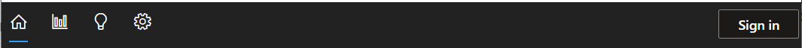
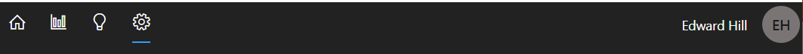
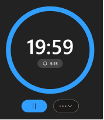
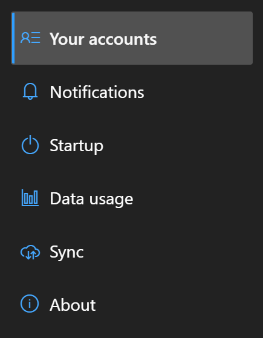
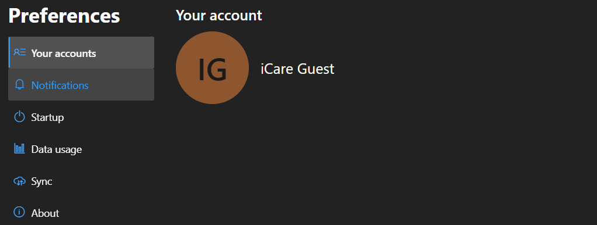
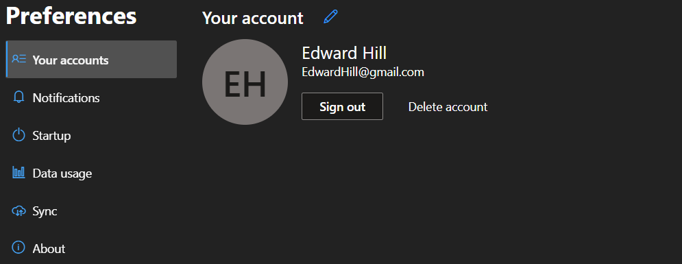
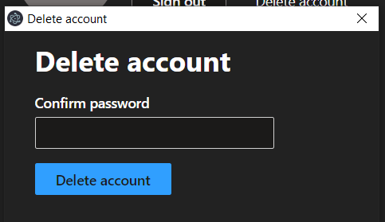

# iCare User Guide

### by Team Paladins

**iCare User Guide Link** 
https://discordapp.com/channels/808522944044859463/808522944044859468/844054321166811194

# 1 Introduction

## 1.1 Why iCare?

Many of us spend plenty of time staring at the computer screen every day. This can put a lot of strain on our eyes and cause eye fatigue. iCare is a desktop app that uses the 20-20-20 rule to motivate users to develop good habits to avoid eye strain without being too intrusive to their schedule. iCare would suggest users to take a 20-second break every 20 minutes and look at something at least 20 feet away.

Disclaimer : 
Please note that iCare is not intended to be a substitute for professional medical advice. Always seek the advice of your physician or qualified health provider with any questions you may have.

## 1.2 The 20-20-20 rule

For every 20 minutes spent using a screen, look at something 20 feet away for 20 seconds. 

This is done to take care of your eyes in the current digital age where many people spend their day staring at their screens.

While the rule recommends that you look at something that is 20 feet away, being exact isn’t the idea. You should just try to focus on something that is far away from you for 20 seconds, which is the amount of time it takes for your eyes to completely relax.

Of course, most people do not keep track of the time and get absorbed in reading or working when looking at a screen. Using iCare to set a timed reminder to pop up will help you take your needed break to rest your eyes.

# 2 Installation
Installation is simple and takes just a few minutes.
## 2.1 Windows

1. Open your browser and navigate to &lt;TODO: insert site link>. 
2. Click the green **_Download iCare for Windows_** button.
3. Once the download is complete, open **iCareSetup.exe** to finish installation

## 2.2 macOS

1. Open your browser and navigate to icare.github.io/setup. 
2. Click the green **_Download iCare for Mac_** button.
3. Once the download is complete, open Finder and navigate to the downloaded file
4. Double-click **_iCareSetup.dmg_** to open.
5. Once installation is complete, drag the iCare app into your Applications folder.

## 2.3 Linux

**TODO**

# 3 Getting Started

## 3.1 Application overview

In the upper left-hand corner of the iCare window, we have four tabs that refer to four different screens. By default, you start on the first tab, the Home screen, whenever you open the application. The other tabs can only be used if you are logged into an account. 

The second tab, the Usage Statistics screen, shows you data and app usage statistics for the past 7 days if there are any available on the server. The third tab, the Insights screen, shows insights cards that are generated by the iCare application based on any data and application usage statistics you have on the server. The fourth tab is the Preferences screen that shows you your custom user saved preferences on the account.

In the upper right-hand corner, we have the Sign-in button that opens up the Login window. If you are already logged in, it will display your display name there.

_▲The various tabs of the application (for a guest)_ 

_▲The various tabs of the application (for a user account)_ 

**Application Icon Overview**
<table>
  <tr>
   <td><strong>Image</strong>
   </td>
   <td><strong>Name</strong>
   </td>
   <td><strong>Description</strong>
   </td>
  </tr>
  <tr>
   <td>
   </td>
   <td><strong>Home</strong>
   </td>
   <td>Opens the <strong>Home screen</strong>, which houses the timer.
   </td>
  </tr>
  <tr>
   <td>
   </td>
   <td><strong>Usage Statistics</strong>
   </td>
   <td>Opens the <strong>Usage Statistics screen.</strong>
   </td>
  </tr>
  <tr>
   <td>
   </td>
   <td><strong>Insights</strong>
   </td>
   <td>Opens the<strong> Insights screen.</strong>
   </td>
  </tr>
  <tr>
   <td>
   </td>
   <td><strong>Preferences</strong>
   </td>
   <td>Opens the <strong>Preferences screen.</strong>
   </td>
  </tr>
  <tr>
   <td>
   </td>
   <td><strong>Sign in</strong>
   </td>
   <td>Opens the <strong>Sign-in Popup window.</strong>
   </td>
  </tr>
</table>

## 3.2 Exiting iCare

The iCare window can be hidden by clicking on the application close button. When the application is hidden, it is running and performing its tasks in the background.

To exit iCare, right-click on the iCare icon on the system tray. In the context menu, click “**Quit**”. Once the app quits, it will not be running anymore.

_▲The iCare icon and its context menu in the Windows system tray_

# 4 Timer
## 4.1 Overview of the timer interface

_▲The timer on the Home screen_

When you start the iCare application, the timer on the Home screen will start automatically from the default 20 minutes. If you have an account and a customized timer notification interval, the timer will start from that customized interval.

At the end of your timer, a break notification will appear and have you take a 20 second break away from the screen. When your break is over, the timer will automatically start counting down again.

This feature is default by nature and cannot be disabled. If you want your timer to stop, you must press the pause button underneath the timer. Just keep in mind that this will reset the timer back to its default notification interval.

**Timer Overview**
<table>
  <tr>
   <td><strong></strong>
   </td>
   <td><strong>Name</strong>
   </td>
   <td><strong>Description</strong>
   </td>
  </tr>
  <tr>
   <td>
   </td>
   <td><strong>Start/Pause</strong>
   <td>
   If the timer is paused, start the timer.

   Otherwise, if the timer is running, pauses the timer.
   </td>
  </tr>
  <tr>
   <td>
   </td>
   <td><strong>More</strong>
   </td>
   <td>Expands a pop-up menu with additional buttons.

Restarts the countdown.

Opens the timer in a new window.
   </td>
  </tr>
  <tr>
   <td>
   </td>
   <td><strong>Remaining time</strong>
   </td>
   <td>The remaining time in MM:SS format.
   </td>
  </tr>
  <tr>
   <td>
   </td>
   <td><strong>End time</strong>
   </td>
   <td>The time in which the timer will end.
   </td>
  </tr>
</table>

## 4.2 How breaks work

_▲The popup notification_

_▲The fullsreen notification_

In iCare, a break occurs when the timer finishes, which results in a pop-up notification that indicates the start of the 20 second break. 

While the initial pop-up notification is small, five seconds into the break, the pop-up notification will turn into a full-screen overlay that takes over your screen. During the time the notification or overlay is present, the break timer will reset when it senses any mouse movement.

Note
: Notification sound playback is currently unsupported on Linux.

# 5 iCare Account
## 5.1 Why make an account?

To be able to use all of iCare’s extensive features, you must register and create an account. This will allow you to keep track of your data and app usage (if desired) and generate insights based on those statistics. 

Additionally, creating an account will allow you to customize your experience that will be stored in iCare servers to use for any device with the iCare application installed that you log into.

## 5.2 How to sign-up

_▲The sign-up screen_

1. Click Sign in at the top right corner. The Sign-in pop-up window should appear.
2. Click ‘Don’t have an account?’ to go to the sign-up page.
3. Complete all fields.
4. Provide your name, email address, and create a password for your iCare account.
    1. Your password must contain at least 8 characters.
    2. Your email address must follow the email format.
5. Click Sign up.

## 5.2 How to sign-in

_▲The sign-in screen_

1. Click Sign in at the top right corner. The Sign in window should appear.
2. On the sign in page, enter the email address and password that you registered with.
3. Click Sign in.

# 6 Usage Statistics

## 6.1 Data Usage

By default, iCare will collect your PC’s data usage statistics associated with your account. It will keep track of the total amount of screen time and the total amount of times the timer has been successfully used per day on the account.

This information will be used for you to keep track of the time you have spent on your device and how much you have been diligently following the 20-20-20 rule over the past 7 days.

_▲Weekly usage shown on the Usage Statistics screen_

If you do not want iCare to collect your data, it is possible to turn off this data collection feature in your account’s user preferences. Furthermore, when you delete your account the data associated with your account will automatically be deleted from our server.

## 6.2 App Usage

By default, iCare will collect information on how much time you spend on any applications that your PC will use when linked to your iCare account. These application statistics will be used for you to keep track of the amount of time you have spent on these applications over the past 7 days.

_▲ App usage on the Usage Statistics screen_

If you do not want iCare to collect your application data, you can turn this feature off in **Preferences**. Furthermore, when you delete your account the application data associated with your account will automatically be deleted from our server.

Note: App usage collection is currently unsupported on macOS and Linux.

# 7 Insights

## 7.1 Default Insights

The default insights cards are insight cards that you are always going to get, regardless of any data or app usage statistics.

These insight cards provide great tips that you, as a user of the iCare application, would consider helpful in your journey to take care of your eyes.

_▲The Insights screen_

## 7.2 Custom Insights

Custom insight cards are insight cards that you will receive that are generated from your data and app usage statistics for the past 7 days.

If you do  not have any data or app usage statistics over the past 7 days, then you will not receive any custom insight cards.

# 8 Preferences

## 8.1 Overview of preferences

_▲The sidebar in the Preferences screen_

## 8.2 Your Account

By default, you start at the ‘Your Account’ screen in the Preferences tab.

If you are a guest, then there is nothing that shows on this page other than informing you of your guest status on the application.

_▲The ‘Your account’ screen as a guest

If you are a signed-in user, then the ‘Your Account’ screen will display your display name and your email. It will also allow you to edit your account information, sign out, or delete your account.

_▲The ‘Your account’ screen with a signed-in user_

**‘Your Accounts’ Icon Overview**
<table>
  <tr>
   <td><strong></strong>
   </td>
   <td><strong>Name</strong>
   </td>
   <td><strong>Description</strong>
   </td>
  </tr>
  <tr>
   <td>
   </td>
   <td><strong>Edit</strong>
   </td>
   <td>Opens a pop-up window that allows you to edit your account details (change email or display name) given the correct password.
   </td>
  </tr>
  <tr>
   <td>
   </td>
   <td><strong>Sign Out</strong>
   </td>
   <td>Signs the user out of their account.
   </td>
  </tr>
  <tr>
   <td>
   </td>
   <td><strong>More</strong>
   </td>
   <td>Opens a pop-up window that allows you to delete your account given the correct password.
   

      
   
   
   </td>
  </tr>
</table>

## 8.3 Notifications

The Notification screen is where you can customize your notification settings. This includes the notification interval of the timer, the option to enable sound notifications, and choosing a sound to play during the notification.

   

_▲The ‘Notification’ screen_

**Notifications overview**

<table>
  <tr>
   <td><strong>Option</strong>
   </td>
   <td><strong>Type</strong>
   </td>
   <td><strong>Description</strong>
   </td>
  </tr>
  <tr>
   <td><strong>Notification interval</strong>
   </td>
   <td>Slider
   </td>
   <td>
   

   

Changes the time duration between each break. 

Valid values are multiples of 5 minutes between 5 and 60 minutes.

<em>Default: 20 minutes</em>
   </td>
  </tr>
  <tr>
   <td><strong>Enable sound notifications</strong>
   </td>
   <td>Toggle
   </td>
   <td>Whether to play a sound when the break starts and ends.

<em>Default: On</em>
   </td>
  </tr>
  <tr>
   <td><strong>Sound</strong>
   </td>
   <td>Dropdown
   </td>
   <td>The sound to play when the break starts and ends.

   

<table>
  <tr>
   <td>
   </td>
   <td><strong>Preview</strong>
   </td>
   <td>Plays the currently selected sound.
   </td>
   <td>
   </td>
  </tr>
  <tr>
   <td>
   </td>
   <td><strong>Import</strong>
   </td>
   <td>Import a sound from your local file system.
   </td>
   <td>
   </td>
  </tr>
</table>

<em>Default: Long expected</em>
   </td>
  </tr>
</table>

## 8.4 Startup 

The Startup screen is where you can customize what happens when you start up the iCare application. You can set it so that the iCare application will start when you log into your computer and set it so that the timer will automatically start when iCare runs.

By default, both of these options are enabled.

   

_▲The ‘Startup’ screen_

**Startup overview**

<table>
  <tr>
   <td><strong>Option</strong>
   </td>
   <td><strong>Type</strong>
   </td>
   <td><strong>Description</strong>
   </td>
  </tr>
  <tr>
   <td><strong>Start app on login</strong>
   </td>
   <td><strong>Toggle</strong>
   </td>
   <td>Chooses whether to start the app automatically after logging into your device.

<em>Default: On</em>
   </td>
  </tr>
  <tr>
   <td><strong>Start timer on app startup</strong>
   </td>
   <td><strong>Toggle</strong>
   </td>
   <td>Chooses whether to start the timer automatically after starting the app.

<em>Default: On</em>
   </td>
  </tr>
</table>

## 8.5 Data usage

The ‘Data usage’ screen is where you can enable or disable data and/or app usage statistics. If they are disabled, then the iCare application will not collect data on your PC to send back to the server and you will be unable to generate usage statistics and custom insight cards if there is no data on the server to use.

By default, both of these options are enabled.

   

_▲The ‘Data usage’ screen_

**Data Usage overview**

<table>
  <tr>
   <td><strong>Option</strong>
   </td>
   <td><strong>Type</strong>
   </td>
   <td><strong>Description</strong>
   </td>
  </tr>
  <tr>
   <td><strong>Track my application usage statistics</strong>
   </td>
   <td><strong>Toggle</strong>
   </td>
   <td>Chooses whether to allow the app to record a list of your open apps to track application usage statistics.

<em>Default: On</em>
   </td>
  </tr>
  <tr>
   <td><strong>Enable weekly usage statistics</strong>
   </td>
   <td><strong>Toggle</strong>
   </td>
   <td>Chooses whether to allow the app to track timer usage statistics.

<em>Default: On</em>
   </td>
  </tr>
</table>

## 8.6 Sync

The ‘Sync’ screen is where you can upload or download your preferences settings from the server. This is used to sync local user preferences with the user preferences saved in the server relating to your account.

   

_▲The ‘Sync ‘ screen_

Note : These options are available only if you have signed into iCare.

**Sync overview**
<table>
 <tr>
   <td>Option

   </td>
   <td>Type

   </td>
   <td>Description

   </td>
  </tr>
  <tr>
   <td>Upload

   </td>
   <td>Button

   </td>
   <td>Save and sync current preferences.

The following preferences are synced.

*   Notifications
*   Startup
*   Data usage
   </td>
  </tr>
  <tr>
   <td>
   Download

   </td>
   <td>Button

   </td>
   <td>Download previous syncing preferences.

The following preferences are synced.

*   Notifications
*   Startup
*   Data usage
   </td>
  </tr>

</table>
